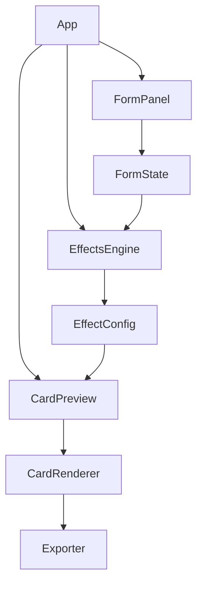

# Diseño Técnico — DevCards

## Visión General

DevCards es una SPA (Single Page Application) frontend pura que genera cartas coleccionables digitales para desarrolladores. No requiere backend. El usuario introduce sus datos en un formulario, ve la carta en tiempo real y puede descargarla como PNG.

Stack tecnológico:
- **Framework**: React 18 + TypeScript
- **Estilos**: CSS Modules + CSS custom properties para temas por Clase
- **Renderizado de carta**: HTML/CSS dentro de un `div` referenciado con `useRef`
- **Exportación PNG**: `html2canvas` (captura el DOM renderizado)
- **Animaciones**: CSS animations / `@keyframes` para efectos holográfico y borde dorado
- **Build**: Vite
- **Testing unitario**: Vitest + Testing Library
- **Testing de propiedades**: fast-check

---

## Arquitectura

La aplicación sigue una arquitectura de componentes con separación clara entre lógica de dominio y presentación.



El estado del formulario fluye hacia arriba hasta `App`, que lo pasa al `EffectsEngine` para calcular el `EffectConfig`, y ambos (estado + efecto) se pasan al `CardPreview`.

---

## Componentes e Interfaces

### `FormPanel`

Componente controlado que gestiona los inputs del usuario.

```typescript
interface FormState {
  name: string;
  playerClass: 'Frontend' | 'Backend' | 'Fullstack' | 'DevOps';
  level: number | '';
  technologies: [TechEntry, TechEntry, TechEntry];
}

interface TechEntry {
  name: string;
  score: number | '';
}
```

Responsabilidades:
- Validación inline de rangos (Nivel 0–50, Puntuación 1–99)
- Validación de nombre obligatorio al intentar descargar
- Emitir `onChange(FormState)` en cada cambio de campo

### `CardPreview`

Componente de presentación pura. Recibe `FormState` + `EffectConfig` y renderiza la carta.

```typescript
interface CardPreviewProps {
  form: FormState;
  effect: EffectConfig;
  cardRef: React.RefObject<HTMLDivElement>;
}
```

Dimensiones fijas: `400×560px`. Escala visual 2× en exportación.

### `EffectsEngine`

Módulo puro (sin estado, sin efectos secundarios) que evalúa las condiciones de activación.

```typescript
interface EffectConfig {
  active: boolean;
  type: 'golden' | 'holographic' | null;
}

interface EffectRule {
  id: string;
  evaluate: (form: FormState) => boolean;
  effectType: 'golden' | 'holographic';
}

function evaluateEffects(form: FormState, rules: EffectRule[]): EffectConfig;
function registerRule(rule: EffectRule): void;
```

Las reglas se registran en un array configurable. Las reglas built-in son:
1. Suma > 270 → activa con 100% de probabilidad
2. Suma entre 240–270 → activa con 40% de probabilidad
3. Combinación legendaria → activa siempre

### `Exporter`

Módulo que usa `html2canvas` para capturar el `div` de la carta.

```typescript
async function exportCard(cardRef: HTMLDivElement, name: string): Promise<void>;
```

Configuración de `html2canvas`: `scale: 2` para resolución 2× (800×1120px). Nombre de archivo: `devcard-[nombre].png`.

---

## Modelos de Datos

```typescript
// Clases disponibles
type PlayerClass = 'Frontend' | 'Backend' | 'Fullstack' | 'DevOps';

// Configuración visual por clase
interface ClassTheme {
  primaryColor: string;
  secondaryColor: string;
  icon: string; // emoji o SVG inline
  backgroundGradient: string;
}

const CLASS_THEMES: Record<PlayerClass, ClassTheme> = {
  Frontend: { primaryColor: '#3B82F6', secondaryColor: '#1D4ED8', icon: '🎨', backgroundGradient: '...' },
  Backend:  { primaryColor: '#10B981', secondaryColor: '#065F46', icon: '⚙️', backgroundGradient: '...' },
  Fullstack:{ primaryColor: '#8B5CF6', secondaryColor: '#5B21B6', icon: '⚡', backgroundGradient: '...' },
  DevOps:   { primaryColor: '#F59E0B', secondaryColor: '#92400E', icon: '🚀', backgroundGradient: '...' },
};

// Combinaciones legendarias (configurable)
const LEGENDARY_COMBOS: string[][] = [
  // Frontend
  ['React', 'TypeScript', 'Node.js'],
  ['Vue', 'TypeScript', 'Vite'],
  ['Next.js', 'TypeScript', 'Tailwind'],
  ['React', 'GraphQL', 'TypeScript'],
  ['Svelte', 'TypeScript', 'Vite'],
  // Backend
  ['Python', 'Docker', 'Kubernetes'],
  ['Rust', 'WebAssembly', 'Docker'],
  ['Go', 'Kubernetes', 'gRPC'],
  ['Java', 'Spring Boot', 'Kafka'],
  ['Node.js', 'PostgreSQL', 'Redis'],
  // Fullstack
  ['React', 'Node.js', 'PostgreSQL'],
  ['Next.js', 'Prisma', 'PostgreSQL'],
  ['Vue', 'Laravel', 'MySQL'],
  ['Angular', 'NestJS', 'MongoDB'],
  // DevOps
  ['Docker', 'Kubernetes', 'Terraform'],
  ['Ansible', 'Terraform', 'Jenkins'],
  ['GitHub Actions', 'Docker', 'AWS'],
  ['Prometheus', 'Grafana', 'Kubernetes'],
  // Wildcards míticos
  ['Linux', 'Vim', 'Git'],
  ['Assembly', 'C', 'Rust'],
];
```

---

## Propiedades de Corrección

*Una propiedad es una característica o comportamiento que debe cumplirse en todas las ejecuciones válidas del sistema — esencialmente, una afirmación formal sobre lo que el sistema debe hacer. Las propiedades sirven de puente entre las especificaciones legibles por humanos y las garantías de corrección verificables automáticamente.*

### Propiedad 1: Validación de rango de Nivel

*Para cualquier* valor de Nivel introducido fuera del rango [0, 50], el formulario debe rechazarlo y mostrar un mensaje de error; para cualquier valor dentro del rango, debe aceptarlo sin error.

**Valida: Requisito 1.2**

### Propiedad 2: Validación de rango de Puntuación

*Para cualquier* valor de Puntuación introducido fuera del rango [1, 99], el formulario debe rechazarlo y mostrar un mensaje de error; para cualquier valor dentro del rango, debe aceptarlo sin error.

**Valida: Requisito 1.3**

### Propiedad 3: Descarga bloqueada con datos incompletos

*Para cualquier* estado del formulario con campos obligatorios vacíos (nombre vacío o tecnologías incompletas), el botón de descarga debe estar deshabilitado.

**Valida: Requisitos 1.4, 1.5, 4.4**

### Propiedad 4: Activación de efecto especial por suma alta

*Para cualquier* conjunto de 3 puntuaciones cuya suma supere 270, el Motor de Efectos debe devolver `active: true`.

**Valida: Requisito 5.1**

### Propiedad 5: Activación probabilística de efecto especial

*Para cualquier* conjunto de 3 puntuaciones cuya suma esté entre 240 y 270 (inclusive), el Motor de Efectos debe activar el efecto con una frecuencia estadísticamente cercana al 40% en un número suficientemente grande de evaluaciones.

**Valida: Requisito 5.2**

### Propiedad 6: Activación por combinación legendaria

*Para cualquier* combinación de tecnologías que figure en la lista de combinaciones legendarias, el Motor de Efectos debe devolver `active: true` independientemente de las puntuaciones.

**Valida: Requisito 5.3**

### Propiedad 7: Sin efecto con puntuaciones bajas

*Para cualquier* conjunto de 3 puntuaciones cuya suma sea inferior a 240 y cuyas tecnologías no formen una combinación legendaria, el Motor de Efectos debe devolver `active: false`.

**Valida: Requisito 5.5**

### Propiedad 8: Nombre de archivo de exportación

*Para cualquier* nombre de desarrollador válido, el archivo PNG generado debe tener el nombre `devcard-[nombre].png`.

**Valida: Requisito 4.2**

### Propiedad 9: Extensibilidad del Motor de Efectos

*Para cualquier* nueva regla registrada mediante `registerRule`, el Motor de Efectos debe evaluarla junto con las reglas existentes sin modificar el comportamiento de las reglas previas.

**Valida: Requisito 7.1**

---

## Manejo de Errores

| Situación | Comportamiento |
|---|---|
| Nivel fuera de rango | Mensaje inline bajo el campo, sin bloquear el previsualizador |
| Puntuación fuera de rango | Mensaje inline bajo el campo correspondiente |
| Nombre vacío al descargar | Mensaje inline, botón de descarga deshabilitado |
| Tecnología sin nombre o puntuación | Botón de descarga deshabilitado |
| Fallo en `html2canvas` | Toast/mensaje de error: "La descarga no pudo completarse" |
| Campos vacíos en previsualizador | Valores por defecto visualmente distinguibles (texto en gris, placeholder) |

---

## Estrategia de Testing

### Tests unitarios (Vitest + Testing Library)

Cubren casos concretos, integraciones y condiciones de error:

- Renderizado del formulario con valores por defecto
- Mensajes de error para cada validación (nivel, puntuación, nombre, tecnologías)
- Que el botón de descarga esté deshabilitado con datos incompletos
- Que `evaluateEffects` devuelva `active: true` para suma > 270
- Que `evaluateEffects` devuelva `active: false` para suma < 240 sin combo legendaria
- Que `evaluateEffects` devuelva `active: true` para cada combo legendaria configurada
- Que `registerRule` añada la regla y sea evaluada correctamente
- Que el nombre de archivo exportado siga el patrón `devcard-[nombre].png`

### Tests de propiedades (fast-check, mínimo 100 iteraciones por propiedad)

Cada test referencia la propiedad del diseño con el formato:
`// Feature: dev-cards, Property N: <texto>`

```typescript
// Feature: dev-cards, Property 1: Validación de rango de Nivel
fc.assert(fc.property(
  fc.integer({ min: -1000, max: 1000 }),
  (level) => {
    const result = validateLevel(level);
    if (level < 0 || level > 50) return result.error !== null;
    return result.error === null;
  }
), { numRuns: 100 });

// Feature: dev-cards, Property 2: Validación de rango de Puntuación
fc.assert(fc.property(
  fc.integer({ min: -1000, max: 1000 }),
  (score) => {
    const result = validateScore(score);
    if (score < 1 || score > 99) return result.error !== null;
    return result.error === null;
  }
), { numRuns: 100 });

// Feature: dev-cards, Property 4: Activación por suma alta
fc.assert(fc.property(
  fc.tuple(
    fc.integer({ min: 91, max: 99 }),
    fc.integer({ min: 91, max: 99 }),
    fc.integer({ min: 91, max: 99 })
  ),
  ([a, b, c]) => {
    // a+b+c > 270 garantizado
    const result = evaluateEffects(buildForm([a, b, c]), DEFAULT_RULES);
    return result.active === true;
  }
), { numRuns: 100 });

// Feature: dev-cards, Property 7: Sin efecto con puntuaciones bajas
fc.assert(fc.property(
  fc.tuple(
    fc.integer({ min: 1, max: 79 }),
    fc.integer({ min: 1, max: 79 }),
    fc.integer({ min: 1, max: 79 })
  ).filter(([a, b, c]) => a + b + c < 240),
  ([a, b, c]) => {
    const result = evaluateEffects(buildFormNonLegendary([a, b, c]), DEFAULT_RULES);
    return result.active === false;
  }
), { numRuns: 100 });

// Feature: dev-cards, Property 8: Nombre de archivo de exportación
fc.assert(fc.property(
  fc.string({ minLength: 1 }),
  (name) => {
    const filename = buildFilename(name);
    return filename === `devcard-${name}.png`;
  }
), { numRuns: 100 });

// Feature: dev-cards, Property 9: Extensibilidad del Motor de Efectos
fc.assert(fc.property(
  fc.record({ id: fc.string(), effectType: fc.constantFrom('golden', 'holographic') }),
  (ruleConfig) => {
    const rules = [...DEFAULT_RULES];
    const newRule: EffectRule = { ...ruleConfig, evaluate: () => true };
    registerRule(newRule);
    // Las reglas previas siguen evaluándose igual
    const before = evaluateEffects(buildForm([50, 50, 50]), DEFAULT_RULES);
    const after = evaluateEffects(buildForm([50, 50, 50]), [...DEFAULT_RULES, newRule]);
    return after.active === true; // nueva regla siempre activa
  }
), { numRuns: 100 });
```

La Propiedad 5 (probabilística) se valida con un test estadístico: ejecutar `evaluateEffects` 1000 veces con suma en [240, 270] y verificar que la tasa de activación esté entre 30% y 50% (margen de tolerancia estadística).

La Propiedad 3 y la Propiedad 6 se cubren con tests unitarios específicos dado que dependen de estado de UI (botón deshabilitado) y de una lista fija configurable respectivamente.
